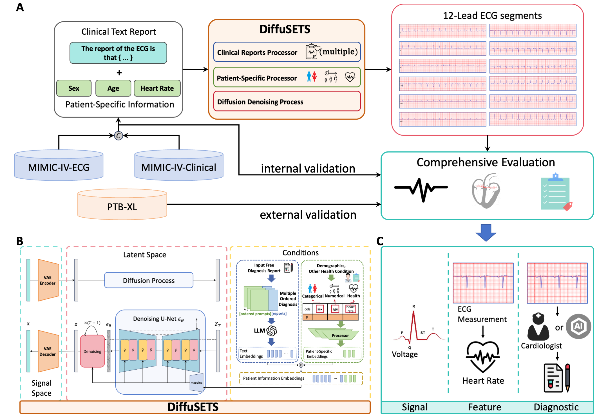

# DiffuSETS

A **Web Demo** of paper [**_DiffuSETS: 12-lead ECG Generation Conditioned on Clinical Text Reports and Patient-Specific Information_**](http://arxiv.org/abs/2501.05932)

**Prerequisities** can be found at [Our Huggingface🤗 Hub](https://huggingface.co/Laiyf/DiffuSETS_KT). Put them under the root of this repo as `./prerequisites/`.

**Usage**

```
DiffuSETS_inference.py [-h] [--text TEXT] [--age AGE] [--sex SEX] [--hr HR]

options:
  -h, --help   show this help message and exit
  --text TEXT  Clinical text report, multi-reports should be split by '|'
  --age AGE    Age of patient
  --sex SEX    Sex of patient
  --hr HR      Heart Rate of patient
```



If you find our tool useful in your study, please cite:
```
@misc{lai2025diffusets12leadecggeneration,
      title={DiffuSETS: 12-lead ECG Generation Conditioned on Clinical Text Reports and Patient-Specific Information}, 
      author={Yongfan Lai and Jiabo Chen and Deyun Zhang and Yue Wang and Shijia Geng and Hongyan Li and Shenda Hong},
      year={2025},
      eprint={2501.05932},
      archivePrefix={arXiv},
      primaryClass={cs.LG},
      url={https://arxiv.org/abs/2501.05932}, 
}
```